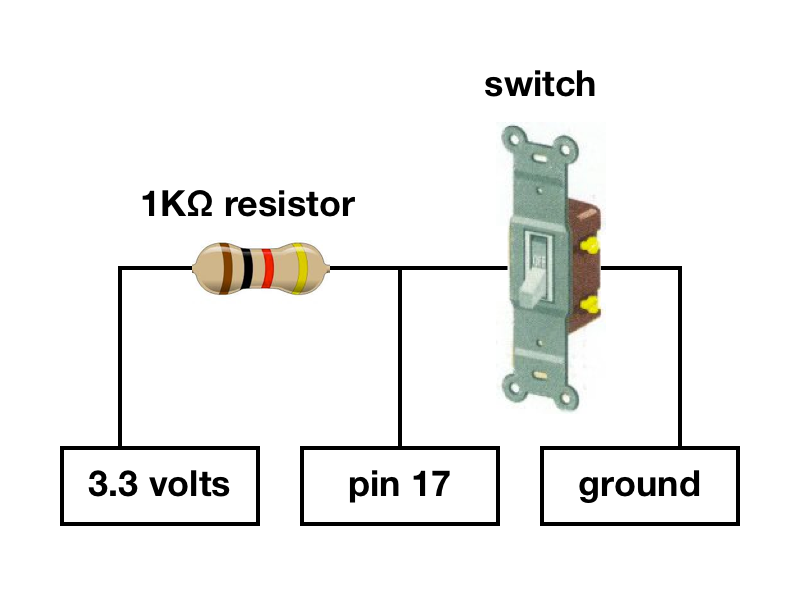

# lightswitch
A website controlled with a household light switch.

Requirements:
- Firebase account (free tier)
- RaspberryPi running NodeJS
- Hardware:

## Helpful links

- [Node embedded development](https://learn.adafruit.com/node-embedded-development)
- [Firebase: realtime data hosting platform](https://www.firebase.com/)
- [ThreeJS: Javascript WebGL library](http://threejs.org/)
